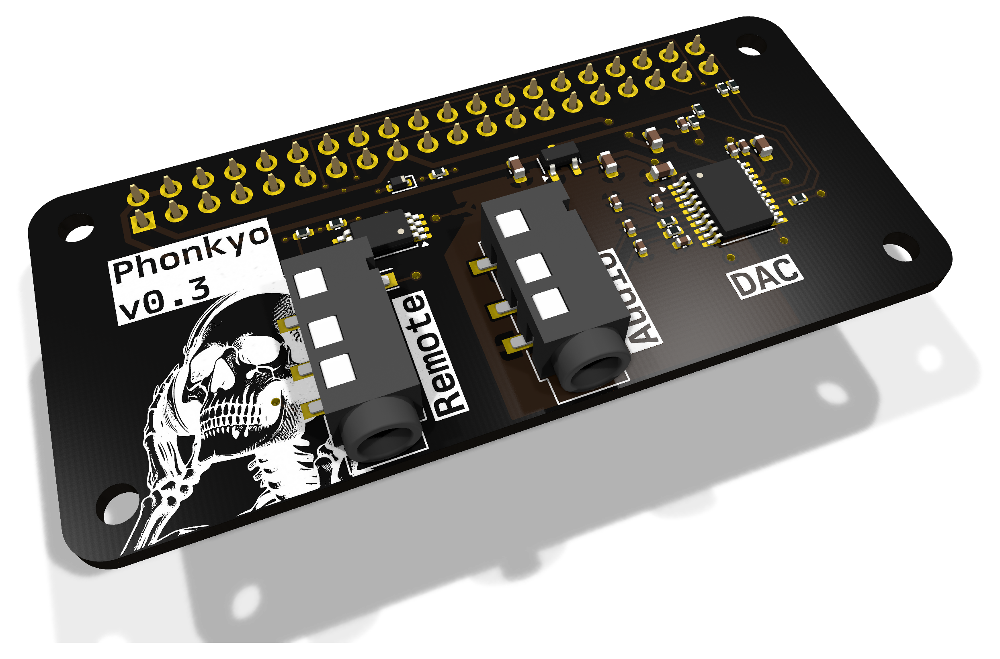
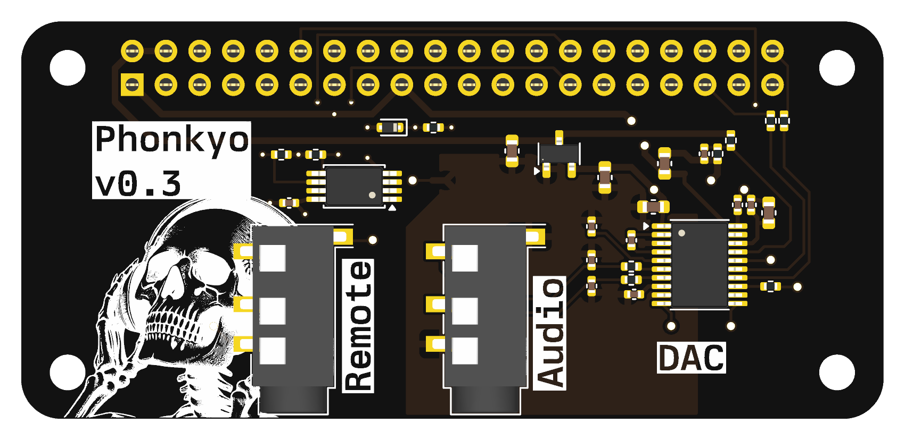
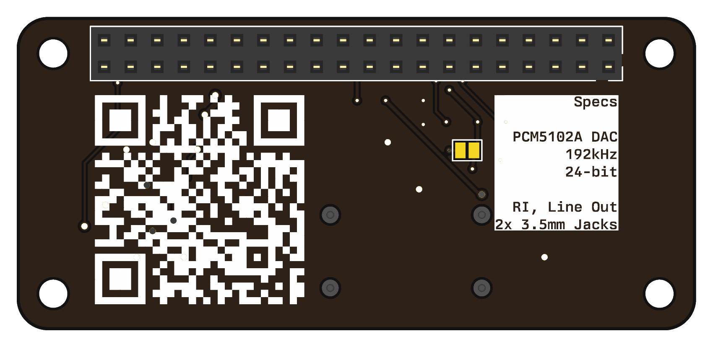

# Phonkyo

A PiHat for Onkyo RI-enabled devices, hence the name (PiHat Onkyo).

Phonkyo makes a Raspberry Pi behave like one of Onkyo's own docks. Onkyo receivers have a small RI (Remote
Interactive) jack on the back, which docks use to switch the receiver on and change it to the dock input. Phonkyo speaks
the same protocol, so when you start playing music the receiver comes on and selects DOCK by itself, and after a few
minutes of silence it switches off again.

The music comes from the Pi itself: a PCM5102A DAC on the hat turns it into an AirPlay 2 receiver, a Spotify Connect
device and a headless Plexamp player, feeding the receiver's dock input through a line-level output.

I believe this device could also be used for other RI-enabled devices, such as Marantz, but I have no way to test it
(and therefore implement support)!

## What it does

- **Follows playback.** When something starts playing, the receiver powers on and switches to its DOCK input. When
  playback stops, it switches off again, but only if phonkyo was the one that turned it on.
- **High-quality line output.** PCM5102A DAC, 24-bit/192 kHz, on a 3.5 mm line-out jack meant for an amplifier's
  line input.
- **Onkyo RI control.** A second 3.5 mm jack connects to the receiver's RI port. It sends commands and listens to the
  codes the receiver sends back.
- **The receiver's remote controls Plexamp.** Play/pause, next, previous, fast-forward, rewind and repeat on the
  receiver's own remote work on Plexamp, just as they would on an Onkyo dock. AirPlay and Spotify can't be controlled
  this way; see `install/MANIFEST.md`.
- **Plug-and-play (v0.3).** A HAT ID EEPROM lets the Raspberry Pi recognise the board and load the sound card by itself,
  so there is nothing to add to `config.txt`.

Tested with an Onkyo TX-8020 and a Raspberry Pi Zero 2 W. Selecting the TV input and changing the volume are not
possible over RI on the TX-8020; `install/MANIFEST.md` records the full code search.

## Hardware

| | |
|---|---|
| Form factor | pHAT, 65 x 30 mm, for the Raspberry Pi Zero 2 W (fits any 40-pin Pi) |
| DAC | TI PCM5102A over I2S, own 3.3 V analog regulator |
| Outputs | 3.5 mm line out (J2), 3.5 mm Onkyo RI (J4) |
| RI line | GPIO25, with a series resistor and ESD clamp from v0.3 |
| ID EEPROM | CAT24C256 on ID_SD/ID_SC, write protect by solder jumper (v0.3) |

| Top | Bottom |
|---|---|
|  |  |

The design is in KiCad 10: `phonkyo.kicad_sch` and `phonkyo.kicad_pcb`. **v0.2 is the latest revision that has been built
and tested; v0.3 is designed but not yet built.**

## Buying one

Phonkyo is sold in small, hand-built batches through [obcecado.com/phonkyo](https://obcecado.com/phonkyo/).

- **Basic kit:** an assembled Phonkyo board with the 40-pin header already soldered. €30 plus shipping at the time
  of writing; the product page has the current price.
- **Complete kit:** also includes an audio cable, an RI cable and a 3D-printed case. Not available yet.
- **Shipping** is to European Union countries only.

To order, email [phonkyo@obcecado.com](mailto:phonkyo@obcecado.com?subject=Phonkyo%20order) with:

- the kit you want and how many
- the country it ships to
- your receiver model

I'll reply with the total including shipping and how to pay. There's no online checkout.

RI support varies from receiver to receiver, so check the
[compatibility table](https://obcecado.com/phonkyo/#receiver-compatibility) before ordering. Only the Onkyo TX-8020 has
been tested so far. If yours isn't listed, mention it in your email and I'll tell you what I know.

## Getting started

The software runs on Raspberry Pi OS Lite 64-bit (Trixie) on a Raspberry Pi Zero 2 W. There is no one-step installer
yet. The [setup guide](https://obcecado.com/phonkyo/setup/) walks through it from a blank microSD card, and
`install/MANIFEST.md` has the full technical record of everything to install and configure:

- the DAC and the ALSA setup
- AirPlay 2 (shairport-sync), Spotify Connect (raspotify) and Plexamp
- the RI control code in `software/phonkyo/` and the `phonkyo-monitor` service that follows playback

## Making boards

`production/v0.3/` has everything needed to order assembled boards from JLCPCB: Gerbers, drill files, and a BOM and
placement file with LCSC part numbers. Its README covers the order settings, the parts, and a bring-up checklist for new
boards. The 40-pin header is soldered by hand, and the ID EEPROM is programmed with `make flash` in `hardware/eeprom/`.

`docs/hardware-review-v0.3.md` is a design review of v0.3: what was found, and what was changed.

## Repository layout

| Path | Contents |
|---|---|
| `phonkyo.kicad_*` | KiCad 10 schematic, PCB and project |
| `production/` | Fabrication files for each revision |
| `hardware/eeprom/` | HAT ID EEPROM image source, device tree overlay, build and flash |
| `software/` | RI control, playback monitor, RI sniffer, board detection, systemd unit |
| `install/MANIFEST.md` | Software setup, measured RI timing and verified RI codes |
| `docs/` | Hardware review |
| `art/` | Board artwork and product renders |
| `3dmodels/` | 3D models missing from the KiCad library |
| `adc/` | PCM5102A datasheet |

## Release notes

### v0.1

Initial release of the Phonkyo project. There is no ID EEPROM present yet, and all the hat exposes is a 3.5mm jack that's
connected to the GPIO pin 25 on the Raspberry Pi. Use a mono or a stereo male-to-male cable to connect your Onkyo remote control to the hat.

### v0.2

This release adds the much acclaimed PCM5102A DAC to the design, allowing to expand the functionality of the device beyond a simple
remote control for your home theater system with RI. Depending on your needs, you will now be able to:
- Control your remote interface home theater to your liking
- Expose the Raspberry Pi as a Spotify device
- Expose the Raspberry Pi as an Airplay device
- Expose the Raspberry Pi as a Plex headless player

### v0.3

This release improves on the board design, particularly around power and ground rails, and removes the SCK jumper, as I don't
predict the need for an external clock source in this particular design. It also:
- Fits the HAT ID EEPROM, so the Raspberry Pi sets the board up by itself
- Adds ESD protection and a series resistor on the RI jack
- Moves the DAC's decoupling capacitors next to its pins, and adds one on the analog supply
- Moves the I2S bit clock onto the top layer, over an unbroken ground plane

## Related projects and documentation

[Macsbug article on PCM5102A](https://macsbug-wordpress-com.translate.goog/2021/02/19/web-radio-of-m5stack-pcm5102a-i2s-dac/)

[TI PCM5102A](https://www.ti.com/lit/ds/symlink/pcm5102a.pdf)

[phatDAC](https://shop.pimoroni.com/products/phat-dac) as inspiration

## License

Phonkyo is licensed under [Creative Commons Attribution-NonCommercial-ShareAlike 4.0 International](LICENSE)
(CC BY-NC-SA 4.0). You may build, modify and share it for non-commercial purposes, as long as you credit the project
and share your changes under the same licence. For commercial use, get in touch.

### Third-party content

These files are not covered by the licence above and remain the property of their owners:

- `adc/pcm5102a.pdf`: the PCM5102A datasheet, © Texas Instruments, included unaltered.
- `3dmodels/Jack_3.5mm_PJ-320D-4A.step`: the 3D model of the Korean Hroparts PJ-320D-4A jack (LCSC C95562), from
  LCSC/EasyEDA, used for the 3D renders only.
- Footprints and symbols from the KiCad libraries, used under the KiCad libraries' licence (CC BY-SA 4.0 with an
  exception for designs that use them).
